# 🌿 Sistema de Clasificación KNN Extendido

<div align="center">


</div>

<p align="center">
  
</p>

> Un sistema de clasificación avanzado basado en el algoritmo de k-vecinos más cercanos (k-NN) con múltiples características extendidas, desarrollado como parte de la asignatura de Modelado de Sistemas Software.

## 📖 Índice

- [Características](#-características)
- [Estructura del Proyecto](#-estructura-del-proyecto)
- [Diagrama de clases](#-diagrama-de-clases)
- [Requisitos](#-requisitos)
- [Instalación y Ejecución](#-instalación-y-ejecución)
- [Guía de Uso](#-guía-de-uso)
- [Ejemplos de Clasificación](#-ejemplos-de-clasificación)
- [Fundamentos Teóricos](#-fundamentos-teóricos)
- [Implementación y Arquitectura](#-implementación-y-arquitectura)
- [Licencia](#-licencia)

## ✨ Características

El sistema ofrece un conjunto completo de funcionalidades para clasificación mediante k-NN:

- **Lectura y procesamiento de datasets**: Soporte para archivos CSV con múltiples configuraciones
- **Preprocesamiento de datos**:
    - 🔄 Normalización en rango [0,1]
    - 📊 Estandarización (z-score)
    - 📈 Datos crudos (sin preprocesado)
- **Estadísticas detalladas**:
    - 📉 Valores mínimos, máximos, medias y desviaciones típicas para atributos numéricos
    - 📊 Frecuencias y valores distintos para atributos categóricos
- **Configuración flexible del algoritmo k-NN**:
    - 🎛️ Valor configurable de k (número de vecinos)
    - 📏 Múltiples métricas de distancia (Euclídea, Manhattan, Chebyshev)
    - ⚖️ Diferentes estrategias de peso (igualdad, cercanía, orden fijo)
    - 🎯 Reglas de clasificación personalizables (mayoría simple, umbral)
- **Experimentación avanzada**:
    - 🧪 División automática de conjuntos de entrenamiento y prueba
    - 📋 Matriz de confusión para evaluación de rendimiento
    - 📊 Cálculo de precisión predictiva
- **Sistema de atributos flexible**:
    - 🏷️ Soporte para múltiples atributos de clase en posiciones arbitrarias
    - ⚖️ Pesado de atributos según su importancia para la clasificación

## 🧱 Estructura del Proyecto

```
src/
├── main/
│   ├── java/
│   │   └── knn/
│   │       ├── KNNSystemMain.java                   # Clase principal y menú interactivo
│   │       ├── model/
│   │       │   ├── dataset/
│   │       │   │   ├── Dataset.java                 # Manejo de conjuntos de datos
│   │       │   │   ├── Instance.java                # Representación de instancias
│   │       │   │   ├── PreprocessingType.java       # Tipos de preprocesamiento
│   │       │   │   └── attributes/                  # Clases para atributos
│   │       │   └── classification/
│   │       │       ├── KNNClassifier.java           # Implementación del clasificador
│   │       │       ├── Neighbor.java                # Clase auxiliar para vecinos
│   │       │       ├── metrics/                     # Métricas de distancia
│   │       │       ├── weights/                     # Estrategias de peso
│   │       │       └── rules/                       # Reglas de clasificación
│   │       └── experiment/
│   │           ├── Experiment.java                  # Gestión de experimentos
│   │           └── ExperimentResult.java            # Evaluación de resultados
│   └── resources/
│       ├── iris.csv                                 # Dataset Iris
│       └── glass.csv                                # Dataset Glass
└── test/
    └── java/
        └── knn/                                     # Pruebas unitarias
```

## 📋 Diagrama de clases

```mermaid
classDiagram
    %% Interfaces y clases abstractas principales
    class Attribute {
        <<abstract>>
        -name: String
        -index: int
        +getName() String
        +getIndex() int
        +isClass() boolean
        +getStatistics() String
    }
    
    class Dataset {
        -instances: List~Instance~
        -attributes: List~Attribute~
        -classAttributeIndices: int[]
        -preprocessingType
        -originalInstances: List~Instance~
        +loadFromFile(filename, hasHeader, delimiter, classIndices) void
        +saveToFile(filename, normalized) void
        +normalize(type) void
        +setAttributeWeights(weights) void
        +split(testPercentage, randomize, seed) Dataset[]
        +getDatasetInfo() String
        +getAttributesInfo() String
        +isClassAttribute(index) boolean
    }
    
    class DistanceMetric {
        <<interface>>
        +calculate(a, b, classIndices, weights) double
        +getName() String
    }
    
    class CaseWeightStrategy {
        <<interface>>
        +calculateWeights(neighbors, k) Map
        +getName() String
    }
    
    class ClassificationRule {
        <<interface>>
        +decide(votes) String
        +getName() String
    }
    
    %% Implementación de atributos
    class NumericAttribute {
        -min: double
        -max: double
        -mean: double
        -stdDev: double
        -weight: double
        +updateValue(value) void
        +normalize(value, type) double
        +getWeight() double
        +setWeight(weight) void
    }
    
    class CategoricalAttribute {
        -uniqueValues: Set
        -mapping: Map
        -frequencies: Map
        -isClassAttribute: boolean
        +addValue(value) int
        +getValue(code) String
        +getCode(value) int
        +updateFrequencies(instances) void
    }
    
    %% Clase para instancias
    class Instance {
        -values: double[]
        +getValue(index) double
        +setValue(index, value) void
        +getValues() double[]
    }
    
    %% Implementaciones de métricas
    class EuclideanDistance {
        +calculate(a, b, classIndices, weights) double
        +getName() String
    }
    
    class ManhattanDistance {
        +calculate(a, b, classIndices, weights) double
        +getName() String
    }
    
    class ChebyshevDistance {
        +calculate(a, b, classIndices, weights) double
        +getName() String
    }
    
    %% Implementaciones de estrategias de peso
    class EqualityWeight {
        +calculateWeights(neighbors, k) Map
        +getName() String
    }
    
    class DistanceBasedWeight {
        +calculateWeights(neighbors, k) Map
        +getName() String
    }
    
    class FixedOrderWeight {
        -weights: double[]
        +calculateWeights(neighbors, k) Map
        +getName() String
    }
    
    %% Implementaciones de reglas
    class MajorityRule {
        +decide(votes) String
        +getName() String
    }
    
    class ThresholdRule {
        -threshold: double
        +decide(votes) String
        +getName() String
    }
    
    %% Clases para clasificación y experimentación
    class KNNClassifier {
        -trainingSet: Dataset
        -k: int
        -metric: DistanceMetric
        -weightStrategy: CaseWeightStrategy
        -classificationRule: ClassificationRule
        -mainClassIndex: int
        +setMetric(metric) void
        +setWeightStrategy(strategy) void
        +setClassificationRule(rule) void
        +classify(instance) String
        +getConfiguration() String
    }
    
    class Neighbor {
        -instance: Instance
        -distance: double
        -index: int
        +getInstance() Instance
        +getDistance() double
        +getIndex() int
    }
    
    class Experiment {
        -trainingSet: Dataset
        -testSet: Dataset
        -classifier: KNNClassifier
        +run() ExperimentResult
        +saveTrainingSet(filename) void
        +saveTestSet(filename) void
    }
    
    class ExperimentResult {
        -accuracy: double
        -confusionMatrix: int[][]
        +getAccuracy() double
        +getResultsInfo() String
    }
    
    class KNNSystemMain {
        +mainMenu() void
        +loadDatasetMenu() void
        +preprocessDataset() void
        +configureClassifier() void
        +experimentationMenu() void
        +classifyNewInstance() void
    }
    
    %% Enumeraciones
    class PreprocessingType {
        <<enumeration>>
        NONE
        RANGE_0_1
        STANDARDIZE
    }
    
    %% Relaciones principales
    Attribute <|-- NumericAttribute
    Attribute <|-- CategoricalAttribute
    
    DistanceMetric <|.. EuclideanDistance
    DistanceMetric <|.. ManhattanDistance
    DistanceMetric <|.. ChebyshevDistance
    
    CaseWeightStrategy <|.. EqualityWeight
    CaseWeightStrategy <|.. DistanceBasedWeight
    CaseWeightStrategy <|.. FixedOrderWeight
    
    ClassificationRule <|.. MajorityRule
    ClassificationRule <|.. ThresholdRule
    
    Dataset o-- Instance
    Dataset o-- Attribute
    
    KNNClassifier --> Dataset
    KNNClassifier --> DistanceMetric
    KNNClassifier --> CaseWeightStrategy
    KNNClassifier --> ClassificationRule
    KNNClassifier --> Neighbor
    
    Experiment --> Dataset
    Experiment --> KNNClassifier
    Experiment --> ExperimentResult
    
    KNNSystemMain --> Dataset
    KNNSystemMain --> KNNClassifier
    KNNSystemMain --> Experiment
```



## 🛠️ Requisitos

- Java JDK 8 o superior
- IDE compatible (IntelliJ IDEA recomendado)
- Maven (opcional, para gestión de dependencias)

## 🔧 Instalación y Ejecución

1. **Clonar el repositorio**:
```bash
git clone https://github.com/tu-usuario/PR3-MSS-KNN.git
cd PR3-MSS-KNN
```

2. **Abrir el proyecto en IntelliJ IDEA**:
    - Selecciona `File > Open` y navega hasta la carpeta del proyecto
    - Asegúrate de que la carpeta `src/main/resources` esté marcada como "Resources Root"

3. **Compilar el proyecto**:
    - En IntelliJ: `Build > Build Project`
    - Con Maven: `mvn clean compile`

4. **Ejecutar la aplicación**:
    - En IntelliJ: Ejecuta la clase `knn.KNNSystemMain`
    - Con Maven: `mvn exec:java -Dexec.mainClass="knn.KNNSystemMain"`

## 📚 Guía de Uso

### 1. Cargar un Dataset

El sistema puede cargar datasets en formato CSV. Puedes usar los datasets de ejemplo incluidos:
- `iris.csv`: 150 instancias de flores Iris con 4 atributos numéricos y 3 clases
- `glass.csv`: 214 instancias de tipos de vidrio con 9 atributos numéricos y 6 clases

```
=== Cargar Dataset ===
1. Cargar dataset completo
2. Cargar conjuntos de entrenamiento y prueba
0. Volver al menú principal

Seleccione una opción: 1
Nombre del archivo CSV: src/main/resources/iris.csv
¿El archivo tiene cabecera? (s/n): s
Delimitador (por defecto ','): 
Índices de atributos de clase (separados por comas): 4
```

> **Nota**: Para el dataset Iris, el índice del atributo de clase es 4 (quinta columna).

### 2. Explorar Información del Dataset

Puedes obtener estadísticas detalladas sobre los atributos:

```
=== Información del Dataset Completo ===
Número de instancias: 150
Número de atributos: 5
Atributos de clase: iris
Tipo de preprocesamiento: NONE

=== Attributes Info ===
Atributo: sepal length (Numérico)
  Mínimo: 4.3
  Máximo: 7.9
  Media: 5.84
  Desviación típica: 0.83
  Peso: 1.0
...
```

### 3. Preprocesar Datos

El preprocesamiento es esencial para obtener buenos resultados de clasificación:

```
=== Preprocesamiento ===
1. Sin preprocesamiento (datos crudos)
2. Normalización rango [0,1]
3. Estandarización (z-score)

Seleccione el tipo de preprocesamiento: 2
```

### 4. Configurar el Clasificador

Configure los parámetros del algoritmo k-NN:

```
=== Configuración del Clasificador KNN ===
Valor de k (número de vecinos): 3

Seleccione la métrica de distancia:
1. Distancia Euclídea
2. Distancia de Manhattan
3. Distancia de Chebyshev
Opción: 1

Seleccione la estrategia de peso de casos:
1. Igualdad de votos
2. Cercanía (inversamente proporcional a la distancia)
3. Voto fijo según orden
Opción: 2

Seleccione la regla de clasificación:
1. Mayoría simple
2. Umbral (mayoría cualificada)
Opción: 1
```

### 5. Experimentación

Evalúe el rendimiento del clasificador:

```
=== Experimentación ===
Porcentaje para conjunto de prueba (0-1): 0.3
¿Generar conjunto de prueba aleatoriamente? (s/n): s
Semilla para generación aleatoria (por defecto 1234): 

Ejecutando experimento...

=== Resultados del Experimento ===
Precisión Predictiva: 0.9556

Matriz de Confusión:
             Iris-setosa  Iris-versicolor  Iris-virginica  (Predicho)
Iris-setosa      15            0               0
Iris-versicolor   0            13              1
Iris-virginica    0            1               15
(Real)
```

### 6. Clasificar Nuevas Instancias

Predice la clase de nuevas observaciones:

```
=== Clasificar Nueva Instancia ===
Ingrese los valores para cada atributo (separados por comas):
0: sepal length
1: sepal width
2: petal length
3: petal width
4: iris (clase)
5.1,3.5,1.4,0.2,

Clase predicha: Iris-setosa
```

## 🔬 Ejemplos de Clasificación

### Dataset Iris
El dataset Iris es perfecto para ilustrar el funcionamiento del clasificador k-NN:

<table align="center">
<tr>
  <td align="center"></td>
</tr>
<tr>
  <td align="center"><b>Ejemplo de clasificación k-NN (k=3)</b></td>
</tr>
</table>

Con el preprocesamiento adecuado y k=3, el sistema puede lograr una precisión predictiva superior al 95% en este dataset.

## 📘 Fundamentos Teóricos

### El Algoritmo k-NN

El método de k-vecinos más cercanos (k-NN) es un algoritmo de aprendizaje supervisado basado en instancias. Su funcionamiento se basa en los siguientes principios:

1. **Búsqueda de vecinos**: Para clasificar una nueva instancia, se buscan las k instancias más cercanas del conjunto de entrenamiento.

2. **Cálculo de distancias**: La "cercanía" se determina mediante métricas de distancia como:
    - **Distancia Euclídea**: $d(x,y) = \sqrt{\sum_{i=1}^{n} (x_i - y_i)^2}$
    - **Distancia Manhattan**: $d(x,y) = \sum_{i=1}^{n} |x_i - y_i|$
    - **Distancia Chebyshev**: $d(x,y) = \max_{i=1..n} |x_i - y_i|$

3. **Asignación de clase**: La clase asignada a la nueva instancia depende de las clases de sus k vecinos más cercanos, considerando:
    - Estrategias de peso: Determina cuánto "voto" tiene cada vecino
    - Reglas de clasificación: Cómo se decide la clase final en base a los votos

4. **Preprocesamiento**: Normalizar o estandarizar los datos para evitar que atributos con valores altos dominen el cálculo de distancias.

## 🏗️ Implementación y Arquitectura

El sistema está diseñado siguiendo principios de orientación a objetos y modularidad:

- **Patrón Strategy**: Usado para intercambiar diferentes métricas, estrategias de peso y reglas de clasificación.
- **Abstracción de atributos**: Jerarquía de clases para manejar diferentes tipos de atributos.
- **Separación de responsabilidades**: Módulos independientes para dataset, clasificación y experimentación.

## 📄 Licencia

Este proyecto está licenciado bajo la Licencia MIT - consulta el archivo LICENSE para más detalles.

---

Desarrollado por Daniel Alejandro Álvarez Casablanca - Grado en Ingeniería Informática
